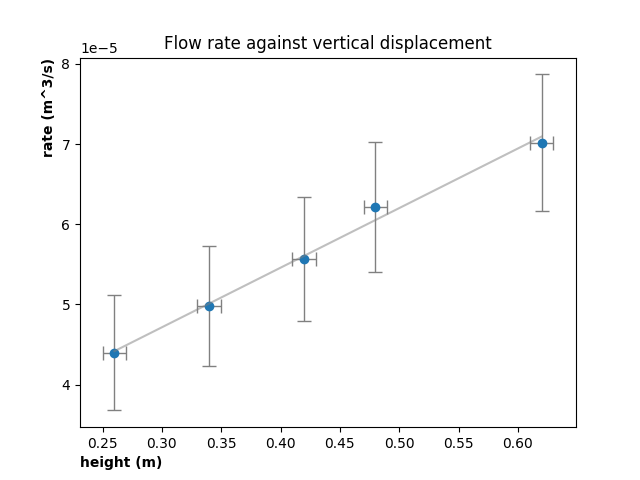

# Physics Practicals



This repository contains a set of scripts for processing experimental
data obtained during physics practicals.

## Methodology

For each experiment, the general procedure follows the steps:

1. Load the experimental data
2. Process raw data to mitigate/reduce uncertainty
3. Manipulate the sanitised data to establish the relationship among
   variables
4. Generate visualisations (plots)
5. Export the processed data to CSV

## Project Structure

The `experiments/` directory contains the scripts that do the data
processing (1 per experiment). The data that these scripts work on is
stored in the `data/` directory, which contains 3 subdirectories:

- `in/` - contains the raw data
- `out/` - processed data is written to this directory
- `plots/` - generated plots and figures are saved to this directory

Common among all experiments is the _I/O_ of data. This is handled by a
set of functions which are packaged separately to the individual
experiments. Additionally, this repository contains some utilities for
debugging and introspection at run time. These utilities reside in the
`functions` package.

## Deployment

Install the specified dependencies (you may wish to create/start a
virtual environment first):

```{.shell}
python3 -m pip install -r requirements.txt
```

Edit the `config.py` file where specified to ensure that the scripts can
locate the input data.

```{.python}
import os
data_dir = os.path.expanduser('~') + "/repos/physics/data/" # << edit this line
in_dir = data_dir+"in/"
out_dir = data_dir+"out/"
plot_dir = data_dir+"plots/"
```

Finally, run the scripts in the `experiments/` directory.
